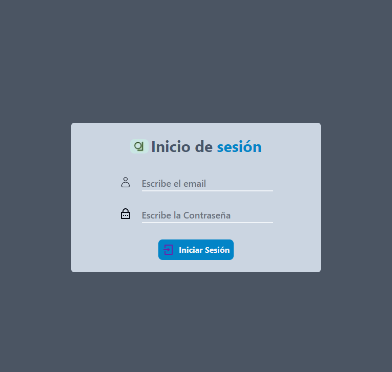
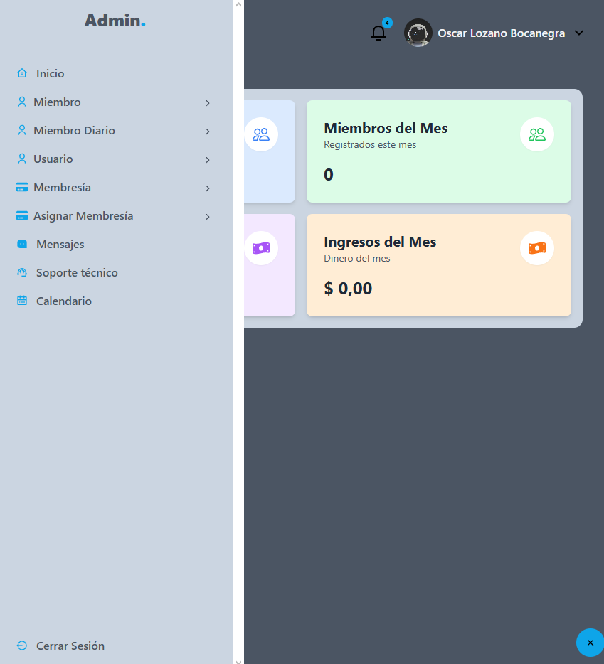
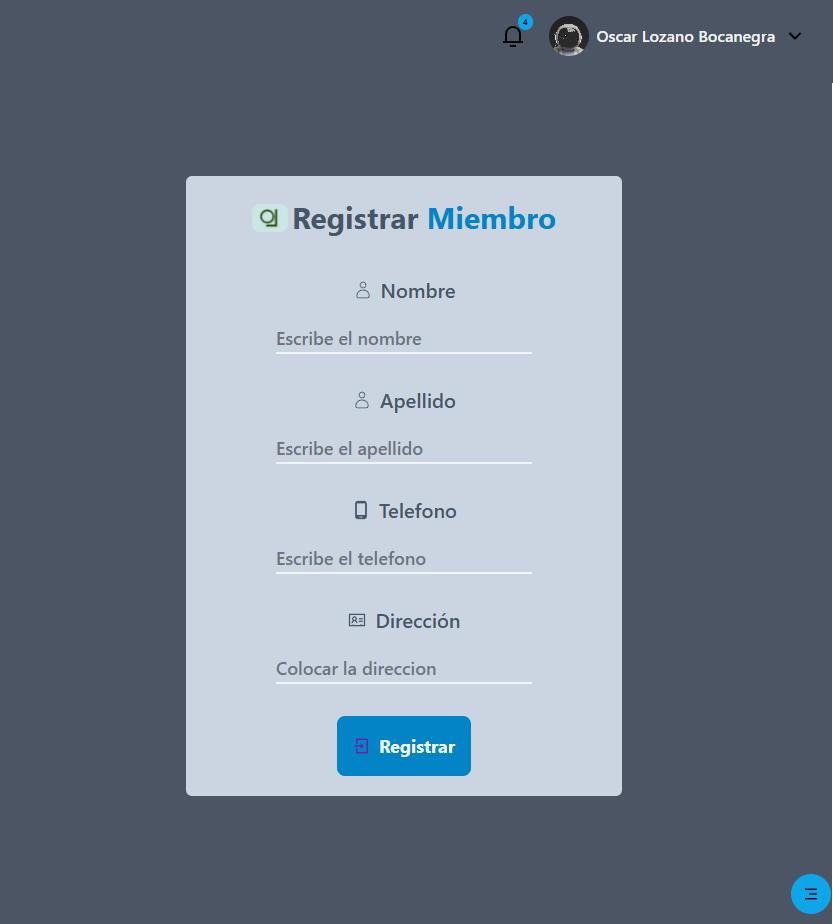
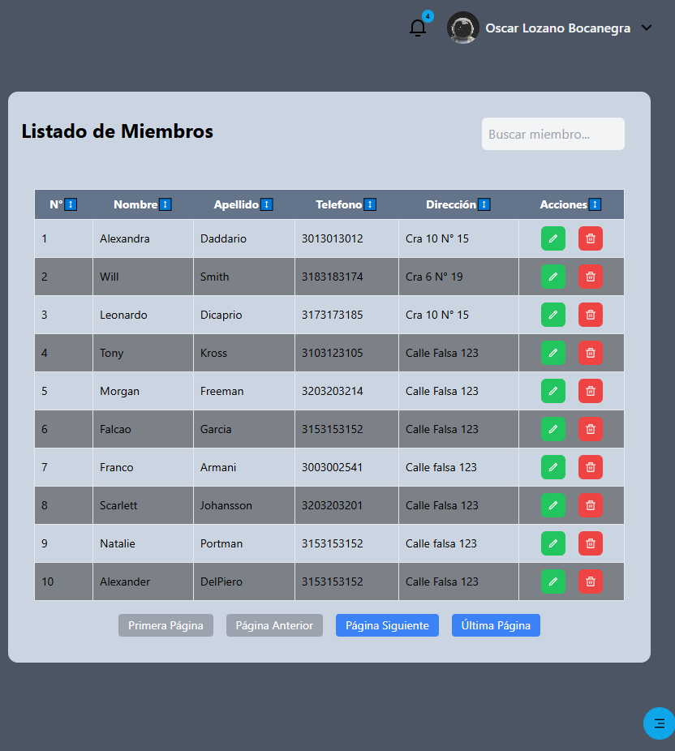
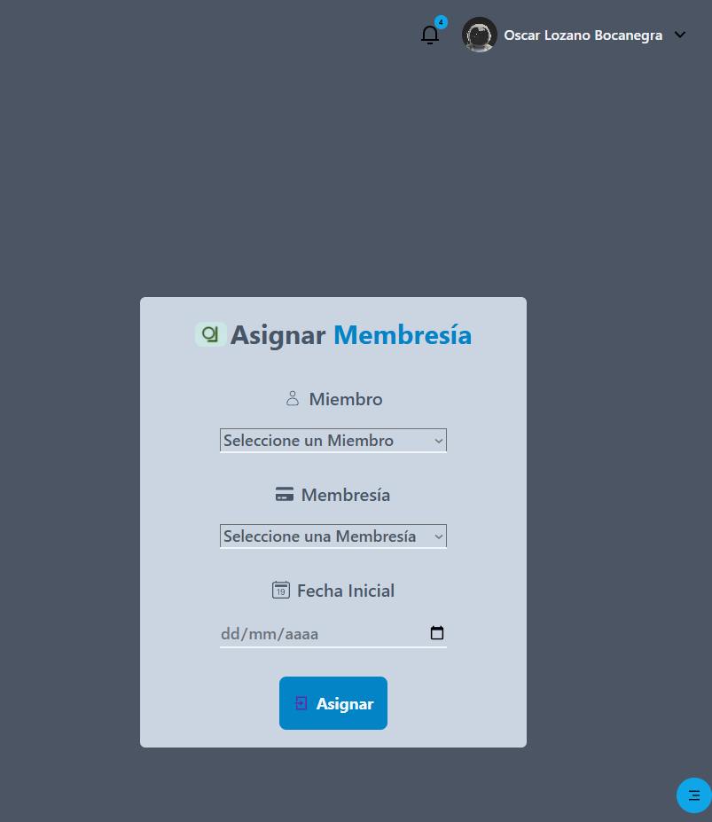
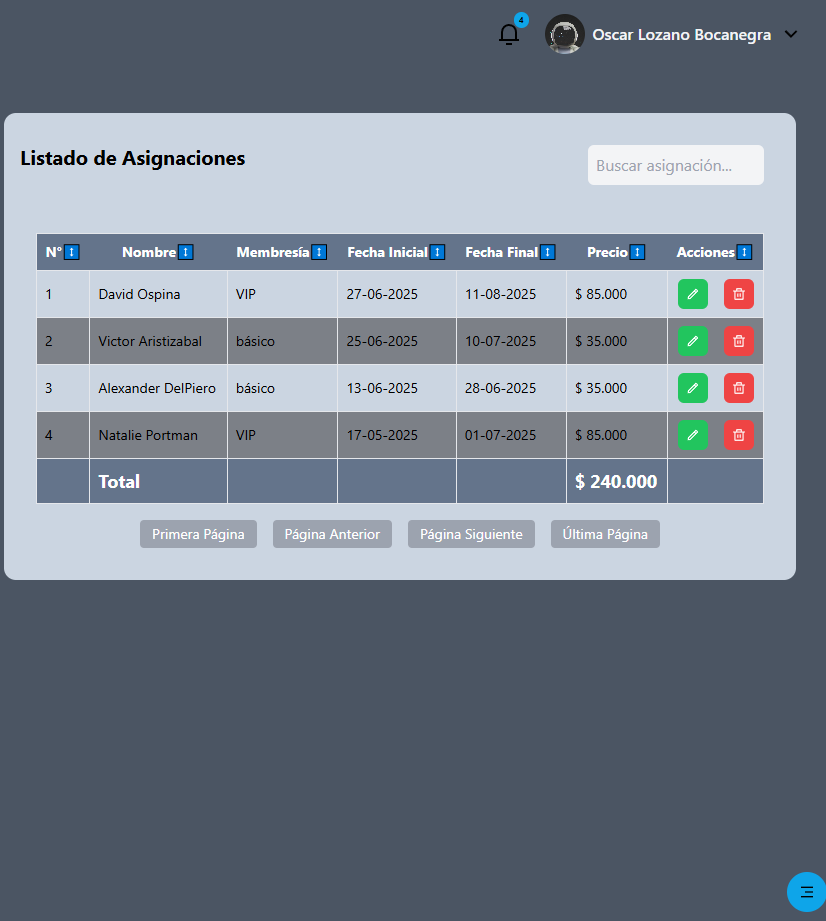
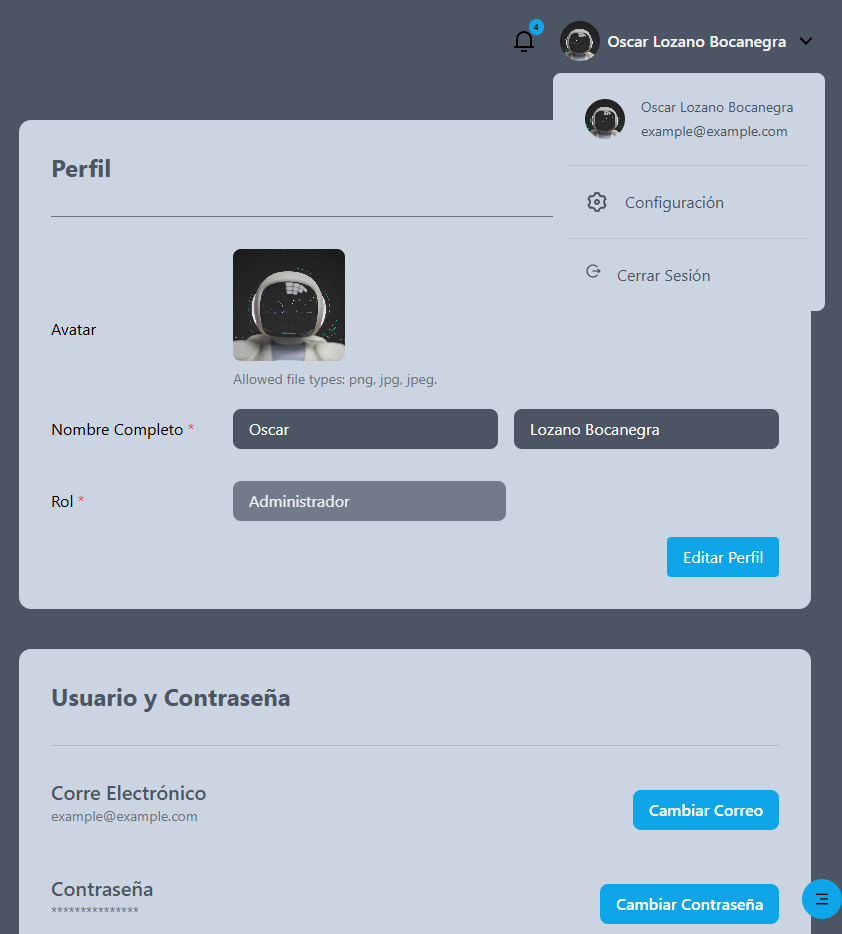

# Gym Management System (Fullstack)

Este proyecto nace de una necesidad real: digitalizar la gestión de membresías en gimnasios locales que aún dependen de procesos manuales o hojas de cálculo propensas a errores. Es una solución integral que permite administrar usuarios, pagos y servicios de forma eficiente.

## Demo Visual

**Inicio Sesión**



**Home**



**Miembros**

- **Registro:**



- **Lista**



**Asignar Membresías**

- **Registro:**



- **Lista**



**Perfil Usuario**




## Tecnologías Utilizadas

**Frontend:**

- React.js con TypeScript (Tipado fuerte para evitar errores).
- Tailwind CSS (Diseño responsivo y moderno).
- React Router para navegación.

**Backend:**

- Django Rest Framework (API escalable).
- MySQL (Persistencia de datos relacionales).
- TokenAuthentication para autenticación segura.

## Características

- **Gestión de Miembros:** Registro, edición, eliminación y visualización de usuarios.
- **Control de Membresías:** Seguimiento de estados de pago y fechas de vencimiento.
- **Interfaz Responsiva:** Optimizado para uso en tablets y computadoras de escritorio.
- **Consumo de API:** Arquitectura desacoplada mediante peticiones asíncronas.

## Requisitos

- Tener instalado Node.js y npm
- Tener instalado Python y pip
- Tener instalado algun gestor de base de datos, el que ustedes deseen, para este ejemplo usaremos Mysql(Worbench).

## Configuración e Instalación

1. **Clonar el repositorio:**
    ```bash
        git clone <url_del_repositorio>
        cd nombre_Proyecto
    ```

### Backend (Django Rest Framework)

2. **Instalar dependencias:**
   - Crear un entorno virtual: Para evitar instalar las dependencias en el entorno global, es recomendable crear un entorno virtual
        ```bash
            python -m venv entorno, //entorno es el nombre que usted le quiera dar            
        ```
    - Activar el entorno virtual: 
        ```bash
            .\entorno\Scripts\activate            
        ```
    
    - Instalar dependencias: Usamos el archivo requirements.txt para instalar las dependencias del proyecto
        ```bash
            pip install -r requirements.txt
        ```

3. **Configurar la base de datos:**
    - Crear una base de datos en Mysql, para este caso se crea con el nombre "gimnasioreact"

    - Configurar el archivo settings.py para que se conecte a la base de datos en este caso Mysql

    - Ejecutar las migraciones para crear las tablas en la base de datos
        ```bash
            python manage.py makemigrations
            python manage.py migrate
        ```

4. **Ejecutamos el servidor:**
        ```bash
            python manage.py runserver
        ```

## Estructura del proyecto

- **models.py**: Contiene la definición de las entidades del modelo de datos.

- **serializers.py**: Contiene la definición de los serializadores para serializar y deserializar los datos.

- **views.py**: Contiene la definición de las vistas para manejar las solicitudes HTTP.

- **urls.py**: Contiene la definición de las rutas para manejar las solicitudes.

- **settings.py**: Contiene la configuración del proyecto, incluyendo la base de datos.

- **requirements.txt**: Contiene la lista de dependencias del proyecto.


### Frontend (React + TypeScript + Tailwind)

1. **Instalar dependencias**:

    - Navegar al directorio del proyecto frontend
        ```bash
            cd frontend //En este caso el nombre sería gimnasioReact
        ```

    - Instalar dependencias:
        ```bash
            npm install
        ```

2. **Ejecutar el proyecto**:

    - Ejecutar el proyecto con el comando
        ```bash
            npm run dev
        ```

### Estructura del proyecto

- `src/components/ui/`: Carpeta en donde estan los Componentes reutilizables (botones,inputs,label), para los formularios.

- `src/components/Header/`: Componente para el header, que se mostrará al momento que el usuario este en la página principal.

- `src/components/Sidebar/`: Componente para el menu, que se mostrará en la parte izquierda de la página principal.

- `src/components/Table/`: Componente para mostrar la tabla principal en los diferentes modulos donde se requiera.

- `src/layouts/Admin/`: Componente en el cual se renderiza el header, el sidebar y el contenido principal.

- `src/pages/admin/`: Carpeta en donde se encuentran todos los componentes que se estan usando para los modulos (miembros, usuarios, etc...).

- `src/pages/auth/`: Carpeta en donde se encuentran todos los componentes que se estan usando para los modulos de autenticación (login, register, etc...).

- `src/api/`: Carpeta en donde se encuentran los archivos que se estan usando para hacer las peticiones a la API.

